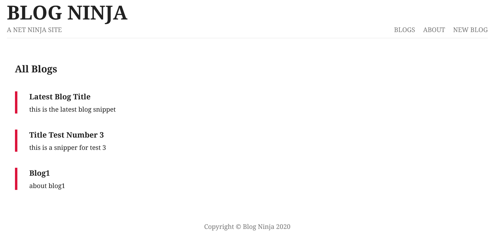

# Node js Blogs Project ( YOUTUBE )

This is the blogs project from the [YouTube crash course]([https://youtu.be/LDB4uaJ87e0](https://www.youtube.com/watch?v=zb3Qk8SG5Ms&list=PL4cUxeGkcC9jsz4LDYc6kv3ymONOKxwBU)).



## Usage

This project uses MongoDb database for   backend.

### Install Dependencies
```bash
npm install nodemon
```
```bash
npm install express
```
```bash
npm install mongoose
```

### Run  App

The server will run on http://localhost:3000

```bash
npx nodemon app
```

